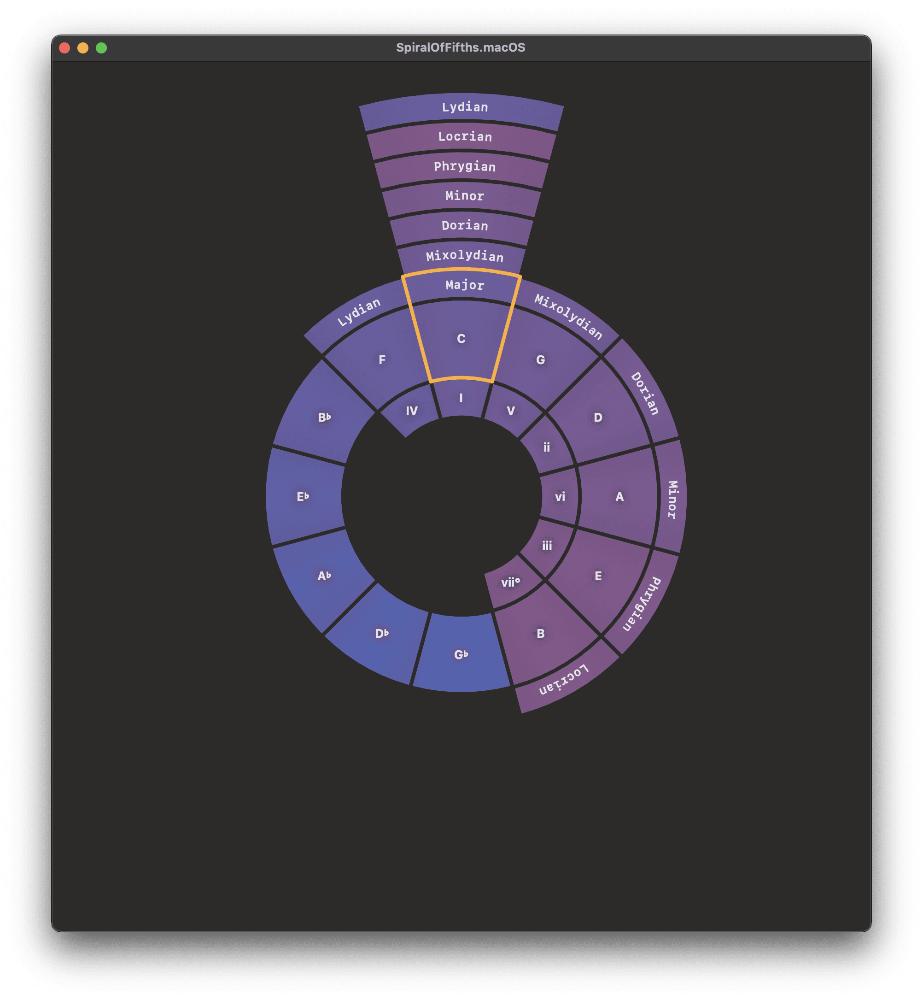
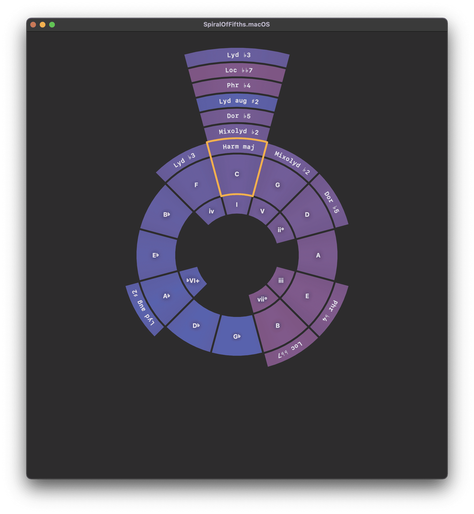
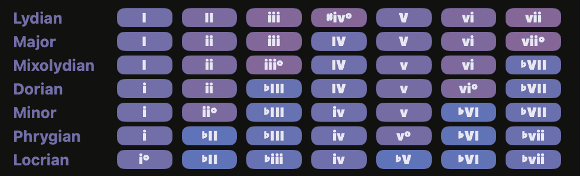

# TheoryDiagrams

A SwiftUI library for interactive music theory diagrams, including the Spiral of Fifths visualization, chord tables, mode formula diagrams, and scale degree diagrams.

## Features

- **SpiralOfFifthsView**: Interactive circular/spiral visualization of the circle of fifths with support for different scales and modes


|           Diatonic           |           Harmonic major           |
| :--------------------------: | :--------------------------------: |
|  |  |

- **ModesTableView**: Table view showing chord relationships and modes


## Requirements

- iOS 16.0+
- macOS 13.0+
- visionOS 1.0+
- Swift 5.9+

## Installation

### Swift Package Manager

Add to your `Package.swift`:

```swift
dependencies: [
  .package(url: "https://github.com/modality-lab/TheoryDiagrams.git", from: "1.0.0"),
]
```

Then add to your target:

```swift
.target(
  name: "YourTarget",
  dependencies: [
    .product(name: "TheoryDiagrams", package: "TheoryDiagrams"),
  ]
)
```

## Usage

```swift
import TheoryDiagrams
import SwiftUI

struct ContentView: View {
  @State private var spiralOfFifths = SpiralOfFifths.cMajor
  
  var body: some View {
    SpiralOfFifthsView(spiralOfFifths: spiralOfFifths)
  }
}
```

## Example App

The `Example/` folder contains a full demo application showcasing all diagram components with:

- Interactive spiral of fifths with note selection
- Onboarding flow explaining music theory concepts
- Settings for customizing the visualization
- Support for iOS, macOS, and visionOS

### Running the Example

1. **Generate and open the project**:

   ```bash
   cd Example
   tuist generate
   open SpiralOfFifthsDemo.xcworkspace
   ```

2. **Set up code signing** (first time only):

   - Open Xcode Preferences (Cmd+,)
   - Go to Accounts tab → Add your Apple ID 
   - Set this ID as Development Team in Signing&Capabilities

3. Select your target platform and run

## Dependencies

- [SwiftMusicTheory](https://github.com/modality-lab/SwiftMusicTheory) - Music theory primitives
- [ModalityCore](https://github.com/modality-lab/ModalityCore) - Core utilities and design components
- [PopupView](https://github.com/exyte/PopupView) - Popup presentations
