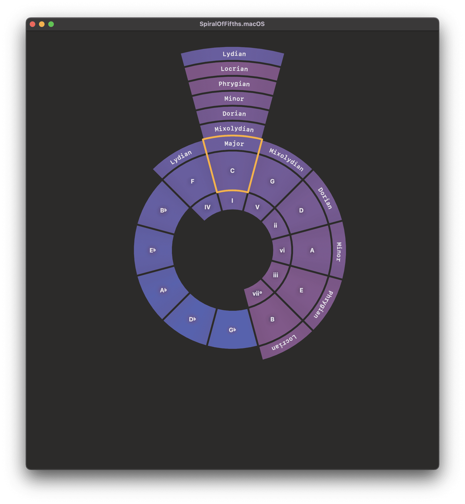
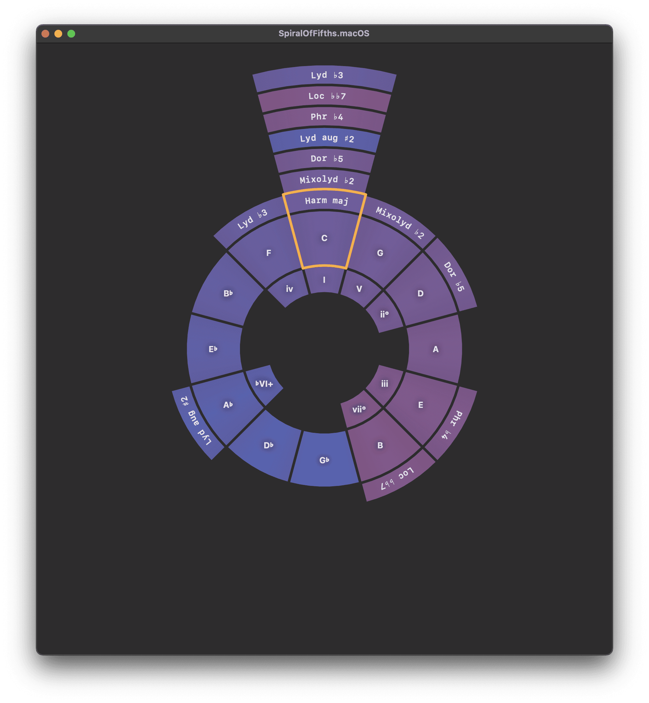
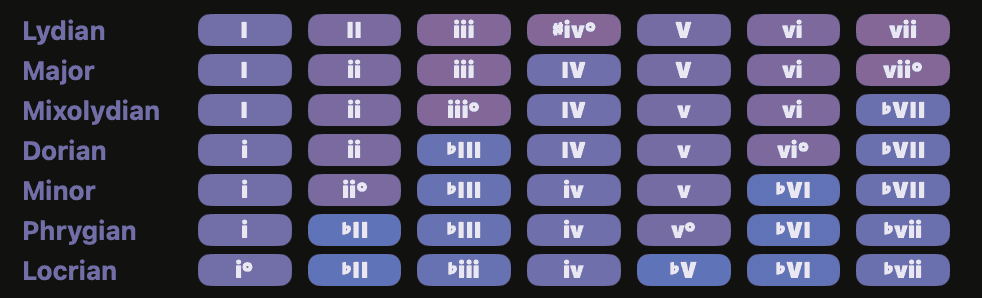

# TheoryDiagrams


A SwiftUI library for interactive music theory diagrams, including the Spiral of Fifths visualization, chord tables, mode formula diagrams, and scale degree diagrams.

## Features

- **SpiralOfFifthsView**: Interactive circular/spiral visualization of the circle of fifths with support for different scales and modes


|           Diatonic           |           Harmonic major           |
| :--------------------------: | :--------------------------------: |
|  |  |

- **ModesTableView**: Table view showing chord relationships and modes


## Requirements

- iOS 16.0+
- macOS 13.0+
- visionOS 1.0+
- Swift 5.9+

## Installation

### Swift Package Manager

Add to your `Package.swift`:

```swift
dependencies: [
  .package(url: "https://github.com/modality-lab/TheoryDiagrams.git", from: "1.0.0"),
]
```

Then add to your target:

```swift
.target(
  name: "YourTarget",
  dependencies: [
    .product(name: "TheoryDiagrams", package: "TheoryDiagrams"),
  ]
)
```

## Tuist

`Package.swift` owns the library and ordinary tests. `Example/Project.swift` owns the demo app. Run from the module directory:

```sh
mise install
mise exec -- tuist install --path Example
mise exec -- tuist generate --path Example --no-open
```

Open `TheoryDiagrams.xcworkspace`. `Package.swift` owns the library, resources, platforms, dependency requirements and unit tests. Tuist 4.210.0 imports the local package with `includeLocalPackageTestTargets`. `Example/Project.swift` adds the demo. The local plugin exports test and coverage names and the demo target. The workspace owns the package test scheme.

For local signing, add `DEVELOPMENT_TEAM = your_team_id` to `Configuration/Signing.local.xcconfig`. Git ignores this file.

The standalone checkout resolves SwiftMusicTheory and ModalityCore from their declared repositories. A Tuist consumer can select local checkouts in its own `Tuist/Package.swift` and use `.external(name: "TheoryDiagrams")`. Add local dependencies for the full library chain when editing it together. Keep each package identity; consumer-owned symbolic links can supply the expected directory names. A consumer that includes `Example/Project.swift` must also declare the demo-only MarkdownUI package.

Development and tests need Swift 6 and the Metal toolchain. CI uses the latest stable Xcode on the macOS runner and the pinned Tuist version. It checks package resolution, unit tests in both build systems, the Release package build, Tuist generation and the macOS demo build.

## Usage

```swift
import TheoryDiagrams
import SwiftUI

struct ContentView: View {
  @State private var spiralOfFifths = SpiralOfFifths.cMajor
  
  var body: some View {
    SpiralOfFifthsView(spiralOfFifths: spiralOfFifths)
  }
}
```

## Example App

The `Example/` folder contains a full demo application showcasing all diagram components with:

- Interactive spiral of fifths with note selection
- Onboarding flow explaining music theory concepts
- Settings for customizing the visualization
- Support for iOS, macOS, and visionOS

### Running the Example

Use the commands in [[README#Tuist]]. Select your target platform and run the `SpiralOfFifthsDemo` scheme.

## Dependencies

- [SwiftMusicTheory](https://github.com/modality-lab/SwiftMusicTheory) - Music theory primitives
- [ModalityCore](https://github.com/modality-lab/ModalityCore) - Core utilities and design components
- [MarkdownUI](https://github.com/gonzalezreal/swift-markdown-ui) - Demo content only
